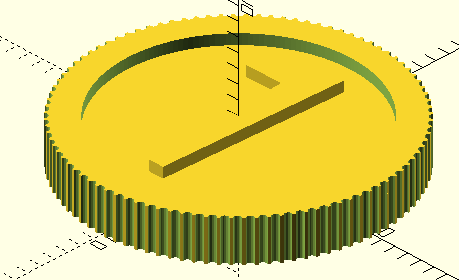
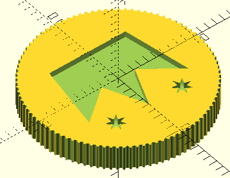

# Machi Koro Replacement Coins

My copy of [Machi Koro](https://boardgamegeek.com/boardgame/143884/machi-koro) has coins which are quite used and worn.

For now, this only contains the "one" coin. Tested with OpenSCAD 2021.01.

## Building Instructions

To make STLs, simply run `make` in this folder. Requires OpenSCAD to be in the path.

## Printing

This model prints best on an SLA printer. Plate it with the coin vertical, the points of the crown towards the build
plate. Add supports along the flat edge of the crown and the tip of the 1. Use copious supports along the coin edge
facing the plate, especially if you're printing many copies at once.

## Previews

